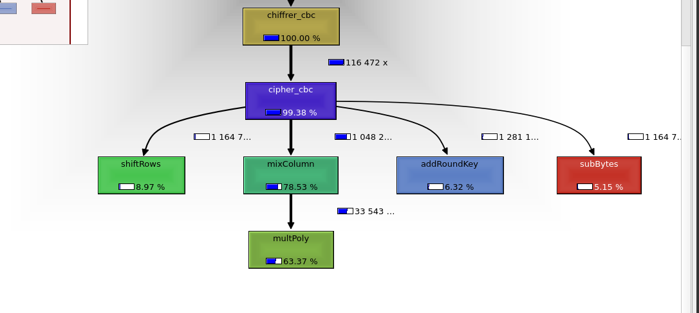

# Carnet de bord

## Séance 1 (21/03/23)

Durant cette séance, nous avons pris connaissance du sujet. Nous avons étudier la documentation AES fournie.
Ensuite, nous avons pris connaissance des fichiers de code fournis. Nous avons pu commencer à mettre en place les premières fonction.
Nous avons définit les classes de type Anneau et Corps en Haskell.
Nous avons ensuite réalisé l'implémentation du corps Z/2Z.
Pour finir, nous avons commencé à réfléchir à comment implémenter des anneaux de polynômes à coefficients dans un corps.

**Objectifs avant la prochaine séance :**
- Ronan :
    - [x] Finir l'implémentation du 3)
    - [x] Faire les tests du 3)
    - [x] Réfléchir à une implémentation du calcul modulo un polynôme
    
- Etienne
    - [x] Réfléchir à une implémentation du calcul modulo un polynôme
    - [x] Faire les tests du 5)

<br>

## Séance 2 (5/04/2023)

Dans cette deuxième séance, nous avons continué l'implémentation en haskell, notamanet en commencant l'inverse module m dans un corps.
Nous avons aussi résolu les nombreux bugs des fonctions déja existantes.
Nous avons ré-étudié la documentation de AES, en se focalisant sur le fonctionnement global du système AES, por avoir une vue plus globale du projet.


**Objectifs avant la prochaine séance :**
- Ronan :
    - [x] Continuer l'étude de la documentation en général
    - [x] DOC
    
- Etienne
    - [x] Faire les tests du 7)
    - [x] Continuer l'étude de la documentation notament en point 4.3

<br>

## Séance 3 (18/04/2023)

Dans cette séance, nous avons continué l'implémentation d'AES. Nous avons commencé les implémentations de SubBytes() et de ShiftRows() d'aes.


**Objectifs avant la prochaine séance :**
- Ronan :
    - [x] MixColumn
    - [x] InvMixColums
    - [x] ShiftRow
    - [x] InvShiftRow
    - [x] KeyExpension
    - [x] tests
    
- Etienne
    - [x] SubBytes
    - [x] InvSubBytes
    - [x] AddRoundKey
    - [x] InvAddRoundKey
    - [x] KeyExpension
    - [x] tests

<br>

## Séance 4 (3/05/2023)

Dans cette séance, nous avons continué l'implémentation d'aes en haskell. Nous avons continué/fini l'implémentation de KeyExpension, puis nous avons mis en place Cipher et InvCipher. Nous avons eu quelques bugs a corriger. Nous avons aussi commencé l'extension de clé pour les autres versions de AES, 192 et 256.

**Objectifs avant la prochaine séance :**
- Ronan :
    - [x] Extension de clé pour les autres versions de AES (192, 256)
    - [x] tests extension clé
    - [x] test cipher 192 et 256
    - [x] (en c) codage shiftRow et son inverse
    - [x] Rédaction d'une documentation
    
- Etienne
    - [x] Corrections et vérification de Cipher et InvCipher
    - [x] tests
    - [x] Rédaction d'une documentation
    - [x] Début du C, reflexion à la structure de donnée à utiliser
    - [x] (en c) codage AddRoundKey
    - [x] (en c) codage SubBytes
    - [x] (en c) codzage InvSubBytes

<br>

## Séance 5 (17/05/2023)
Durant la séance nous avons débuggé les version aes 192 et 256 qui sont maintenant fonctionnelles et avons rédigés des tests pour celles-ci. Nous avons aussi réorganisé le code et commenter les focntions.
Nous avons continuer l'implémentation d'aes en C.

**Objectifs avant la prochaine séance :**
- Ronan :
    - [x] Continuer la documentation
    - [x] Nettoyer le code
    - [x] Continuer le C

- Etienne :
    - [x] Continuer et finir la documentation
    - [x] Continuer le C

 
# Deuxième période

## Séance 6 (5/06/2023)
Durant la séance nous avons continué le code en c.
Nous avons fini l'interface graphique que nous avions commencé dans l'entre-période. 
Nous avons réalisé l'algorithme CBC pour coder et décoder des fichiers de manière fiable.
Nous avons passé beaucoup de temps a debuggé nos programmes.

**Objectifs de la séance :**
- Ronan :
    - [x] Algorithme CBC
    - [x] Correction AES version terminal

- Etienne :
    - [x] Continuer l'interface graphique et l'integrer dans le code
    - [x] Gérer la lecture et l'écriture des fichiers


## Séance 7 (6/06/2023)

Durant cette deuxième séance de la deuxième période, nous allons continuer a implémenter la version CBC d'aes.

Nous avons commencé par utiliser l'outil callgrind, utilisé comme ceci :

> ```valgrind --tool=callgrind <programme>```

Ce qui permet de générer un fichier contenant tout les points de mesures du logiciel. Nous avons eu des problèmes car il n'executait pas le fichier, cer nous avions laissé fsanitize dans les options de compilations. <br> Une fois le fichier de mesures obtenu, nous avons utilisé l'interface de kcachegrind et ouvert le fichier. <br> Nous avons obtenu le graph ci-dessous.


Nous avons alors essayé de trouver des solutions pour optimiser le code, notement de multpoly qui est appelé plus de 33 millions de fois pour encoder un fichier de 1,8mo. <br> <br>

Après avoir recu l'extension de sujet par mail, nous avons implémenté le mode ECB en mode cryptage et décryptage. <br> <br>

Nous avons ensuite codé une fonction pour encoder des fichiers BMP selon les deux modes : ECB et CBC. Nous avons observé le défaut de ECB en observant l'image. <br> <br> <br>

Image Originale

Image encodée ECB

Image encodée CBC


**Objectifs de la séance :**
- Ronan :
    - [x] Algorithme CBC
    - [x] Algorithme ECB
    - [x] Essai optimisation registre processeur

- Etienne :
    - [x] Optimisation du code
    - [x] Coder des fichiers bmp en ecb et cbc
    - [x] ui
  

## Séance 7 (6/06/2023)

Durant cette troisième séance de la deuxième période, nous avons continué à optimiser le code, et à améliorer l'ihm.

Nous avons essayé de calculer l'entropie de l'encodage des pixel de l'image ci dessus pour comparer les versions cbc et ecb d'encodage de fichier.
Nous n'avons pas réussi à la calculer, cependant on a pu remarquer que les pixel était plus uniformément réparti avec la version cbc.

Nous avons également adapté notre code afin de gérer l'encodage des fichiers de la même manière que celle attendue lors de l'évaluation, c'est-à-dire encoder la taille des fichiers sur 4 octets en début de fichier.

Pour l'optimisation, nous avons implémenté une version d'aes utilisant les instructions aes du processeur ce qui nous a permis d'atteindre des vitesses dépassant le Go/s. Cependant nous devons adapter notre mesure des performances d'AES car la lecture et l'écriture des fichiers est lente (mesurer entre la  fin de la lecture et le début de l'écriture).
Nous nous sommmes appuyés sur la documentation des instructions fournie par Intel : 
> https://www.intel.com/content/dam/doc/white-paper/advanced-encryption-standard-new-instructions-set-paper.pdf

Nous avons aussi essayé d'implémenter un système de hash en sha256 afin de pouvoir rentrer un mot de passe de n'importe quelle longueur en guise de "clé".


**Objectifs de la séance :**
- Ronan :
    - [x] Implémentation AES avec les instructions processeur
    - [x] Adaptation du code pour l'encodage des fichiers

- Etienne :
    - [x] Finaliser l'encodage des fichiers bmp
    - [x] Calculer l'entropie
    - [x] Améliorer l'ihm


## Séance 8 (7/06/2023)

Durant cette dernière séance de projet, nous allons finaliser l'encrypatge des fichiers pour correspondre au mode d'encryptage de l'évaluation, nettoyer et réorganiser le code

Nous avons mesurer l'augmentation des performances avec l'ajout des instructions processeur. Ci-dessous deux implémentations de addRoundKey, une avec une boucle for de base, et une autre avec des instructions processeur qui permettent dirrectement de faire un XOR sur 128 bits.

Voici le code avec un for :

```c
void addRoundKey(byte *state, const byte *key) { 
    for (int i = 0; i < 16; i++) {
        state[i] = state[i] ^ key[i];
    }
}
```

Et le code avec les instrucations processeurs :

```c
void addRoundKey(byte *state, const byte *key) {
    __m128i* state128 = (__m128i*) state;
    __m128i* key128 = (__m128i*) key;
    __m128i xor_result = _mm_xor_si128(*state128, *key128);
    _mm_store_si128(state128, xor_result);
}
```

Les tests sont effectués sur 100.000.000 de tours.
| Mode |  Temps |
|--:|:----------|
| for                    | 0.274662 |
| instruction processeur | 0.062970 |

Nous observons bien que le temps est ralativement diminué avec les instructions processeurs. En effet, pour encoder un fichier de 1.8mo, nous avions trouvé à l'aide de vallgrind que 1.000.000

**Objectifs de la séance :**
- Ronan :
    - [x] 

- Etienne :
    - [x] Gestion de l'entrée de mdp
    - [x] Mesure des performances et comparaison
    - [ ] 